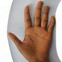

# Генерация синтетических изображений ладоней для обучения биометрических моделей

## Обзор проекта

Этот проект направлен на решение задачи создания синтетических датасетов изображений ладоней, подходящих для обучения моделей машинного обучения, используемых в аутентификации клиентов. Цель проекта — обеспечить высокое качество и разнообразие сгенерированных данных, которые имитируют реальные биометрические данные и могут масштабироваться для обучения. Проект реализован в рамках Всероссийского хакатона по биометрии 2024 г.

Ключевые цели:
- Генерация высококачественных синтетических изображений ладоней.
- Обеспечение достаточного разнообразия датасета для улучшения обобщающей способности моделей.
- Генерация вариаций изображений ладони одного синтетического индивида.

## Структура проекта
```
├── src
│   ├── __init__.py
│   ├── image_generation.py
│   ├── keypoint_detection.py
│   ├── model.py
│   ├── model_setup.py
│   ├── train.py
│   ├── trainer.py
│   └── transformations.py
├── data
│   └── processed_images
│       └── (dataset images)
├── results
│   └── model-88.pt
├── main.py
├── README.md
├── output.gif
├── requirements.txt
└── wgan-gp
```

## Подход к решению

### 1. Сбор и подготовка данных
Для работы был выбран датасет **Human Palm Images** с [Kaggle](https://www.kaggle.com/datasets/feyiamujo/human-palm-images). Этот датасет был выбран из-за:
- Высокого качества изображений.
- Разнообразия поз и условий ладоней.
- Минимальных требований к предобработке.

Альтернативные источники, такие как бесплатные стоковые фотографии (например, Freepik), были рассмотрены для возможного дополнения данных.

### 2. Выбор модели и реализация
Мы исследовали два подхода для генерации изображений: **GAN** и **диффузионные модели**.

#### Реализация WGAN-GP
Параметры:
- Размер изображений: 256x256
- Скорости обучения: `lr_G = 0.00005`, `lr_D = 0.00002`
- Размер батча: 16
- Количество эпох: 1000

Результаты:
- Сгенерированные изображения хорошо передавали базовые структуры ладоней, но не обладали достаточной детализацией и текстурами.
- На изображениях было много шума из-за ограниченных ресурсов обучения.

#### Реализация диффузионной модели
Мы реализовали диффузионную модель с использованием библиотеки **Denoising Diffusion PyTorch**. Архитектура основана на U-Net с итеративной гауссовой диффузией для достижения высокого качества генерации.

Основные параметры:
- Разрешение изображений: 128x128
- Количество шагов: 50 000
- Скорость обучения: `2e-5`
- Размер батча: 16
- Архитектура:
  ```python
  model = Unet(
      dim=64,
      dim_mults=(1, 2, 4, 8),
      channels=3
  ).to(device)
  trainer = Trainer(
      diffusion=model,
      train_batch_size=16,
      train_lr=2e-5,
      train_num_steps=50000,
      gradient_accumulate_every=2,
      ema_decay=0.995,
      results_folder="./results",
      save_and_sample_every=500
  )
  ```

Результаты:
- Высококачественные, реалистичные изображения ладоней с четкими деталями.
- Диффузионная модель значительно превзошла WGAN-GP по качеству визуализации.

### 3. Результаты
Итоговая модель на основе диффузии успешно генерирует:
- Высококачественные синтетические изображения ладоней.
- Вариации одного синтетического индивида путем изменения позы и условий шума.

Пример результата:



## Запуск генерации изображений из репозитория
1. Установите зависимости pip install -r requirements.txt
2. Необходимо убедиться, что в папке results есть файл с [весами](https://drive.google.com/file/d/1AaOvAYpjl3-FsEQ2WD_CtHW74REYTVTZ/view?usp=sharing) model-88.pt.
3. Из склонированного репозитория из корня запускаем файл main.py с указанием папки (для сохранения сгенерированных изображений) и необходимого количества изображений ладоней одного синтетического индивида, например: 
```
python main.py dirname 40
```
В результате, в указанном каталоге создаются изображения.

## Запуск генерации изображений из Google Colab
1. Необходимо создать папку в Google Drive под названием Diffusion_Model. Данная папка должна состоять из папок:
 - results (в нее положить файл с [весами](https://drive.google.com/file/d/1AaOvAYpjl3-FsEQ2WD_CtHW74REYTVTZ/view?usp=sharing))
 - в папке results - должна быть папка generated 
3. После чего запустить данный ноутбук в Google Colab: [ссылка](https://colab.research.google.com/drive/1l94Ig_zMgHkW_kxD5Iz8yRBSjNMVJdkg?usp=sharing) - для генерации изображений все соотвествующие ячейки 
4. Изображения сохранены в results/palm_variations

## Запуск обучения модели из репозитория
В папке data/processed_images/ должен находиться датасет. Наш тренировочный датасет находится по [ссылке](https://drive.google.com/drive/folders/1Iu5WQsy9tmPNHJarNQj0rbwmF05uUum6?usp=sharing) (состоит из изображений 128х128)

1. Запустите из корня проекта файл src/train.py:
```
python src/train.py  
```
2. Веса (файлы .pt) и промежуточные изображения для наблюдения и анализа динамики по качеству гиперпараметров сохраняются в папке results

## Запуск обучения модели из Google Colab
1. Содержание Google Drive должно быть аналогично п.1 из "Запуск генерации изображений из Google Colab"
2. Запустите соответствующие ячейки
3. Веса (файлы .pt) и промежуточные изображения для наблюдения и анализа динамики по качеству гиперпараметров сохраняются в папке results


